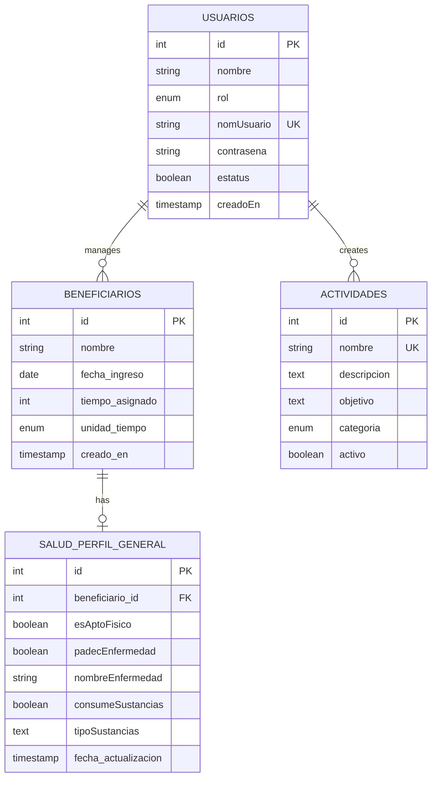

# Database Setup

The SSP Backend API uses **PostgreSQL** as its database and **TypeORM** as the Object-Relational Mapping (ORM) library. This guide covers database configuration, schema design, and entity management.

## PostgreSQL Requirements

### Minimum Version

- **PostgreSQL 12** or higher
- Recommended: **PostgreSQL 14** or **15** for best performance

### Installation

See the [Installation Guide](/installation#2-install-postgresql) for detailed PostgreSQL installation instructions for your operating system.

## Database Configuration

### Creating the Database

Create a dedicated database for the SSP API:

```sql
-- Connect to PostgreSQL
psql -U postgres

-- Create database
CREATE DATABASE ssp_db;

-- Create dedicated user (optional but recommended)
CREATE USER ssp_user WITH ENCRYPTED PASSWORD 'secure_password';

-- Grant privileges
GRANT ALL PRIVILEGES ON DATABASE ssp_db TO ssp_user;

-- Exit
\q
```

### Environment Configuration

Configure database connection in `.env`:

```bash
# Database Configuration
DB_HOST=localhost
DB_PORT=5432
DB_USERNAME=ssp_user
DB_PASSWORD=secure_password
DB_NAME=ssp_db
```

## TypeORM Configuration

### Application Module Setup

TypeORM is configured in `src/app.module.ts:12` using the async pattern to inject environment variables:

```typescript
TypeOrmModule.forRootAsync({
  inject: [ConfigService],
  useFactory: (config: ConfigService) => ({
    type: 'postgres',
    host:     config.get<string>('DB_HOST'),
    port:     Number(config.get<string>('DB_PORT')),
    username: config.get<string>('DB_USERNAME'), 
    password: config.get<string>('DB_PASSWORD'), 
    database: config.get<string>('DB_NAME'),
    autoLoadEntities: true,
    synchronize:      false,
    migrationsRun:    true,
    migrations: [__dirname + '/migrations/*{.ts,.js}'],
  }),
}),
```

### Configuration Options Explained

<Accordion title="autoLoadEntities: true">
  Automatically loads all entities registered in modules without manually adding them to the entities array. This simplifies configuration and reduces boilerplate.
</Accordion>

<Accordion title="synchronize: false">
  **IMPORTANT**: Disables automatic schema synchronization. This is a safety feature to prevent accidental schema changes in production.
  
  <Warning>
    Never set `synchronize: true` in production! It can lead to data loss if your entities don't match the expected schema.
  </Warning>
</Accordion>

<Accordion title="migrationsRun: true">
  Automatically runs pending migrations when the application starts. This ensures the database schema is always up to date.
</Accordion>

<Accordion title="migrations: [...]">
  Specifies where TypeORM should look for migration files. Migrations are stored in `src/migrations/`.
</Accordion>

## Database Schema

The SSP Backend API uses four main tables:

### 1. usuarios (Users)

Stores user accounts with authentication and role information.

**Entity**: `src/shared/users/entities/user.entity.ts:17`

```typescript
@Entity('usuarios')
export class User {
  @PrimaryGeneratedColumn('identity')
  id: number;

  @Column({ type: 'varchar', length: 150 })
  nombre: string;

  @Column({ type: 'enum', enum: RolUsuario })
  rol: RolUsuario;

  @Index({ unique: true })
  @Column({ type: 'varchar', length: 100 })
  nomUsuario: string;

  @Column({ type: 'text' })
  contrasena: string;

  @Column({ type: 'boolean', default: true })
  estatus: boolean;

  @CreateDateColumn({ type: 'timestamp' })
  creadoEn: Date;
}
```

**Schema**:

| Column | Type | Constraints | Description |
|--------|------|-------------|-------------|
| id | integer | PRIMARY KEY, AUTO INCREMENT | User ID |
| nombre | varchar(150) | NOT NULL | Full name |
| rol | enum | NOT NULL | User role (Admin, Psicologo, TrabajoSocial, Guia) |
| nomUsuario | varchar(100) | UNIQUE, NOT NULL | Username for login |
| contrasena | text | NOT NULL | Bcrypt-hashed password |
| estatus | boolean | DEFAULT true | Active/inactive status |
| creadoEn | timestamp | DEFAULT NOW() | Account creation date |

### 2. beneficiarios (Beneficiaries)

Tracks individuals enrolled in service programs.

**Entity**: `src/shared/beneficiarios/beneficiario.entity.ts:14`

```typescript
@Entity('beneficiarios')
export class Beneficiario {
  @PrimaryGeneratedColumn()
  id!: number;

  @Column({ type: 'varchar', length: 150 })
  nombre!: string;

  @Column({
    name: 'fecha_ingreso',
    type: 'date',
    default: () => 'CURRENT_DATE',
  })
  fechaIngreso!: Date;

  @Column({ name: 'tiempo_asignado', type: 'int' })
  tiempoAsignado!: number;

  @Column({
    name: 'unidad_tiempo',
    type: 'enum',
    enum: UnidadTiempoEnum,
    default: UnidadTiempoEnum.MESES,
  })
  unidadTiempo!: UnidadTiempoEnum;

  @CreateDateColumn({ name: 'creado_en' })
  creadoEn!: Date;
}
```

**Schema**:

| Column | Type | Constraints | Description |
|--------|------|-------------|-------------|
| id | integer | PRIMARY KEY, AUTO INCREMENT | Beneficiary ID |
| nombre | varchar(150) | NOT NULL | Full name |
| fecha_ingreso | date | DEFAULT CURRENT_DATE | Entry date to program |
| tiempo_asignado | integer | NOT NULL | Assigned service time |
| unidad_tiempo | enum | DEFAULT 'MESES' | Time unit (HORAS, MESES) |
| creado_en | timestamp | DEFAULT NOW() | Record creation date |

### 3. actividades (Activities)

Manages community service activities.

**Entity**: `src/shared/actividades/actividad.entity.ts:13`

```typescript
@Entity('actividades')
export class Actividad {
  @PrimaryGeneratedColumn()
  id!: number;

  @Column({ type: 'text' ,unique: true})
  nombre!: string;

  @Column({ type: 'text', nullable: true })
  descripcion!: string;

  @Column({ type: 'text', nullable: true })
  objetivo!: string;

  @Column({
    type: 'enum',
    enum: ActividadCategoriaEnum,
    nullable: true,
  })
  categoria!: ActividadCategoriaEnum;

  @Column({ type: 'boolean', default: true })
  activo!: boolean;
}
```

**Activity Categories**:

```typescript
export enum ActividadCategoriaEnum {
  TRABAJO_COMUNITARIO         = 'TRABAJO_COMUNITARIO',
  LIDERAZGO_COMUNITARIO       = 'LIDERAZGO_COMUNITARIO',
  ATENCION_SUSTANCIAS         = 'ATENCION_SUSTANCIAS',
  EDUCACION_PARA_LA_VIDA      = 'EDUCACION_PARA_LA_VIDA',
  PROMOCION_CULTURAL_DEPORTIVA = 'PROMOCION_CULTURAL_DEPORTIVA',
}
```

**Schema**:

| Column | Type | Constraints | Description |
|--------|------|-------------|-------------|
| id | integer | PRIMARY KEY, AUTO INCREMENT | Activity ID |
| nombre | text | UNIQUE, NOT NULL | Activity name |
| descripcion | text | NULLABLE | Activity description |
| objetivo | text | NULLABLE | Activity objective |
| categoria | enum | NULLABLE | Category type |
| activo | boolean | DEFAULT true | Active/inactive status |

### 4. salud_perfil_general (Health Profiles)

Stores comprehensive health information for beneficiaries.

**Entity**: `src/shared/salud/salud.entity.ts:11`

```typescript
@Entity('salud_perfil_general')
export class Salud {
  @PrimaryGeneratedColumn()
  id!: number;

  // 1:1 relationship with Beneficiario
  @OneToOne(() => Beneficiario, { onDelete: 'RESTRICT', eager: false })
  @JoinColumn({ name: 'beneficiario_id' })
  beneficiario!: Beneficiario;

  @Column({ name: 'beneficiario_id', type: 'int', unique: true })
  beneficiarioId!: number;

  @Column({ type: 'boolean', default: true })
  esAptoFisico!: boolean;

  @Column({ type: 'boolean', default: false })
  padecEnfermedad!: boolean;

  @Column({ type: 'varchar', length: 255, nullable: true })
  nombreEnfermedad!: string | null;

  @Column({ type: 'boolean', default: false })
  consumeSustancias!: boolean;

  @Column({ type: 'text', nullable: true })
  tipoSustancias!: string | null;

  @Column({ type: 'varchar', length: 100, nullable: true })
  afiliadoServicioSalud!: string | null;

  @Column({ type: 'boolean', default: false })
  necesitaLentes!: boolean;

  @Column({ type: 'text', nullable: true })
  observacionesMedicas!: string | null;

  @UpdateDateColumn({ name: 'fecha_actualizacion' })
  fechaActualizacion!: Date;
}
```

**Schema**:

| Column | Type | Constraints | Description |
|--------|------|-------------|-------------|
| id | integer | PRIMARY KEY, AUTO INCREMENT | Health profile ID |
| beneficiario_id | integer | UNIQUE, FOREIGN KEY | Reference to beneficiario |
| esAptoFisico | boolean | DEFAULT true | Physically fit |
| padecEnfermedad | boolean | DEFAULT false | Has illness |
| nombreEnfermedad | varchar(255) | NULLABLE | Illness name |
| consumeSustancias | boolean | DEFAULT false | Consumes substances |
| tipoSustancias | text | NULLABLE | Types of substances |
| afiliadoServicioSalud | varchar(100) | NULLABLE | Health service affiliation |
| necesitaLentes | boolean | DEFAULT false | Needs glasses |
| observacionesMedicas | text | NULLABLE | Medical observations |
| fecha_actualizacion | timestamp | AUTO UPDATE | Last update timestamp |

## Entity Relationships



## Database Migrations

### Migration Strategy

The application uses TypeORM migrations for schema management:

<Steps>
  <Step title="Automatic Migration Execution">
    Migrations run automatically on application startup due to `migrationsRun: true` configuration
  </Step>
  
  <Step title="Migration Files">
    Migration files are stored in `src/migrations/` and follow TypeORM naming conventions
  </Step>
  
  <Step title="Schema Safety">
    With `synchronize: false`, schema changes only happen through migrations, preventing accidental data loss
  </Step>
</Steps>

### Creating Migrations

To create a new migration:

```bash
# Generate migration from entity changes
npm run typeorm migration:generate -- -n MigrationName

# Create empty migration
npm run typeorm migration:create -- -n MigrationName
```

### Running Migrations Manually

Migrations run automatically on startup, but you can run them manually:

```bash
# Run pending migrations
npm run typeorm migration:run

# Revert last migration
npm run typeorm migration:revert

# Show migration status
npm run typeorm migration:show
```

<Info>
  If you don't have these scripts in `package.json`, you can add them or run TypeORM CLI directly.
</Info>

## Working with Entities

### Registering Entities

Entities are automatically loaded due to `autoLoadEntities: true`, but they must be registered in their respective modules:

```typescript
import { TypeOrmModule } from '@nestjs/typeorm';
import { User } from './entities/user.entity';

@Module({
  imports: [TypeOrmModule.forFeature([User])],
  // ...
})
export class UsersModule {}
```

### Using Repositories

Inject TypeORM repositories in services:

```typescript
import { Injectable } from '@nestjs/common';
import { InjectRepository } from '@nestjs/typeorm';
import { Repository } from 'typeorm';
import { User } from './entities/user.entity';

@Injectable()
export class UsersService {
  constructor(
    @InjectRepository(User)
    private readonly userRepo: Repository<User>,
  ) {}

  async findAll(): Promise<User[]> {
    return this.userRepo.find();
  }

  async findOne(id: number): Promise<User> {
    return this.userRepo.findOne({ where: { id } });
  }
}
```

## Database Best Practices

<CardGroup cols={2}>
  <Card title="Use Transactions" icon="arrows-rotate">
    Wrap related database operations in transactions to ensure data consistency
  </Card>
  
  <Card title="Index Frequently Queried Fields" icon="magnifying-glass">
    Add database indexes on fields used in WHERE clauses (e.g., `nomUsuario` is already indexed)
  </Card>
  
  <Card title="Validate Data" icon="check">
    Use class-validator decorators on DTOs before saving to database
  </Card>
  
  <Card title="Handle Errors" icon="triangle-exclamation">
    Catch and handle database errors appropriately (unique constraint violations, etc.)
  </Card>
</CardGroup>

## Database Maintenance

### Backup and Restore

```bash
# Backup database
pg_dump -U ssp_user -d ssp_db > backup.sql

# Restore database
psql -U ssp_user -d ssp_db < backup.sql

# Backup with compression
pg_dump -U ssp_user -d ssp_db | gzip > backup.sql.gz

# Restore from compressed backup
gunzip -c backup.sql.gz | psql -U ssp_user -d ssp_db
```

### Monitoring

Monitor database connections and performance:

```sql
-- Show active connections
SELECT * FROM pg_stat_activity WHERE datname = 'ssp_db';

-- Show table sizes
SELECT 
  schemaname,
  tablename,
  pg_size_pretty(pg_total_relation_size(schemaname||'.'||tablename)) AS size
FROM pg_tables
WHERE schemaname = 'public'
ORDER BY pg_total_relation_size(schemaname||'.'||tablename) DESC;

-- Show slow queries (if enabled)
SELECT * FROM pg_stat_statements ORDER BY mean_time DESC LIMIT 10;
```

## Troubleshooting

<Accordion title="Connection refused">
  Ensure PostgreSQL is running and accepting connections:
  
  ```bash
  # Check PostgreSQL status
  sudo systemctl status postgresql
  
  # Check if PostgreSQL is listening
  sudo netstat -plnt | grep 5432
  
  # Verify connection
  psql -U ssp_user -d ssp_db -h localhost
  ```
  
  Check `pg_hba.conf` for authentication settings.
</Accordion>

<Accordion title="Migration errors">
  If migrations fail:
  
  1. Check migration files for syntax errors
  2. Verify database user has CREATE/ALTER permissions
  3. Look at TypeORM logs for specific error messages
  4. Check if migrations table exists: `SELECT * FROM migrations;`
  5. Manually fix schema and mark migration as run if needed
</Accordion>

<Accordion title="Entity not found">
  If TypeORM can't find an entity:
  
  1. Ensure entity is registered in module with `TypeOrmModule.forFeature([Entity])`
  2. Verify `autoLoadEntities: true` in app.module.ts
  3. Check that entity file has proper decorators (`@Entity`, `@Column`, etc.)
  4. Restart the application after adding new entities
</Accordion>

## What's Next?

<CardGroup cols={2}>
  <Card title="Seeding Data" icon="seedling" href="/guides/seeding">
    Learn how to populate the database with initial data
  </Card>
  
  <Card title="Environment Variables" icon="gear" href="/guides/environment-variables">
    Configure database connection settings
  </Card>
  
  <Card title="Testing" icon="flask" href="/development/testing">
    Set up test databases and run tests
  </Card>
  
  <Card title="Deployment" icon="rocket" href="/development/deployment">
    Deploy the database in production
  </Card>
</CardGroup>
